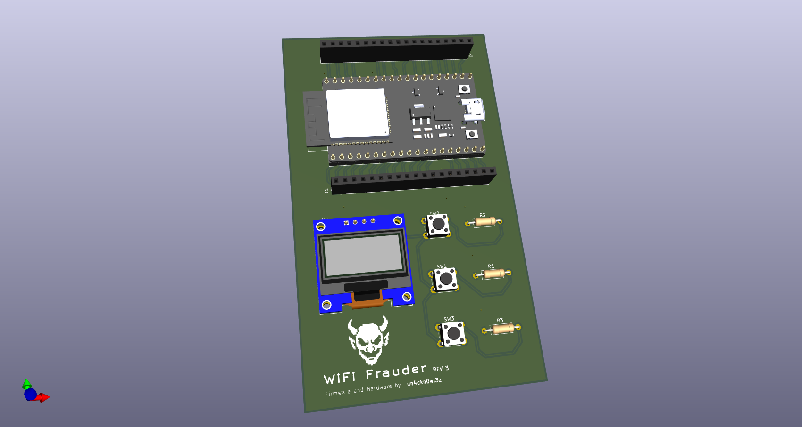

# WiFi Frauder 🚨📡

**WiFi Frauder** is an open-source hardware and firmware project designed to broadcast humorous or custom WiFi SSIDs using an ESP32-based custom PCB.

> ⚠️ Intended for educational and ethical hacking use only. Use responsibly and **never** violate local laws or network policies.

---

## 🟩 PCB Overview

---

## 🔧 Features

- Broadcasts multiple fake WiFi SSIDs simultaneously
- Uses ESP32 Devkit with custom-designed PCB
- User-friendly firmware with pre-defined or dynamic SSID lists
- Lightweight and easy to deploy
- Ideal for pranks, conferences, or WiFi education

---

## 🛠️ Hardware

- **Microcontroller**: ESP32 DevKitC 32E (38 pins)
- **Power**: USB or battery-powered
- **Display**: SSD1306 0.96 I2C OLED

PCB design files and schematics are included in the `/pcb` folder.

---

## 📦 Firmware

- Written in C++ using the Arduino/FreeRTOS framework

---

## To stop spamming
- Press `UP` + `DOWN` button for stop spamming

