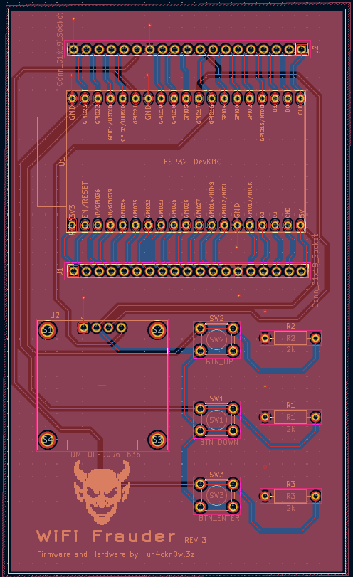
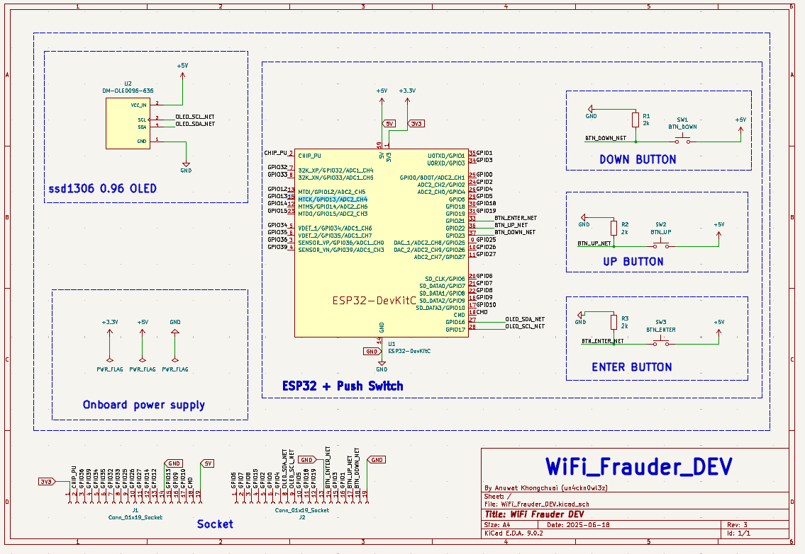

# WiFi Frauder 🚨📡

**WiFi Frauder** is an open-source hardware and firmware project designed to broadcast humorous or custom WiFi SSIDs using an ESP32-based custom PCB.

---

## 🟩 PCB Overview

---

## 🔧 Features

- Random (Slow) – Randomly spams WiFi SSIDs at a slow rate
- Random (Fast) – Randomly spams WiFi SSIDs at a faster rate
- Custom SSID – Spams WiFi SSIDs based on entries from the SPIFFS config file

---

## To stop spamming
- Press both the UP and DOWN buttons simultaneously to stop spamming.

---

## 🛠️ Hardware

- **Microcontroller**: ESP32 DevKitC 32E (38 pins)
- **Power**: USB or battery-powered
- **Display**: SSD1306 0.96 I2C OLED

PCB design files and schematics are included in the `/pcb` folder.

---

## 📦 Firmware

Written in C++ using the Arduino and FreeRTOS frameworks, built with the PlatformIO toolset.
First, build the SPIFFS file system and edit the SSIDs as you like in the `funny_ssid_list.txt` file located in the `/data` folder.
Then, build the main firmware and upload it to the `WiFi Frauder` device.

---
## Disclaimer

⚠️ Intended for educational and ethical hacking use only. Use responsibly and **never** violate local laws or network policies.
